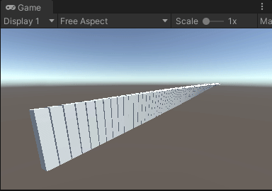

This is a DOTS bootstrap project. Here's a rundown of how it was created:

1. Installed the latest Unity 2020.3 LTS from the Hub.
1. Created a new empty 3D project.
1. Followed the instructions in [DOTS Project Setup](https://docs.unity3d.com/Packages/com.unity.entities@0.17/manual/install_setup.html).
1. Followed the instructions in [Creating a new Hybrid Renderer project](https://docs.unity3d.com/Packages/com.unity.rendering.hybrid@0.11/manual/creating-a-new-hybrid-renderer-project.html) for URP + Hybrid Renderer V2.
1. Cleared out the GI cache to avoid a known issue with the light having a blue tint (Edit > Preferences > GI Cache > Clean Cache).

And a description of the contents:

1. A single scene with a Subscene (for conversion).
1. The Subscene contains an authoring GameObject with the component `Settings` that stores a prefab and a count.
1. The `SpawnSystem` initializes the scene on startup by creating instances of the prefab along the X axis.
1. The `RotationSystem` runs the animation.

See the comments in the source for more detailed information.